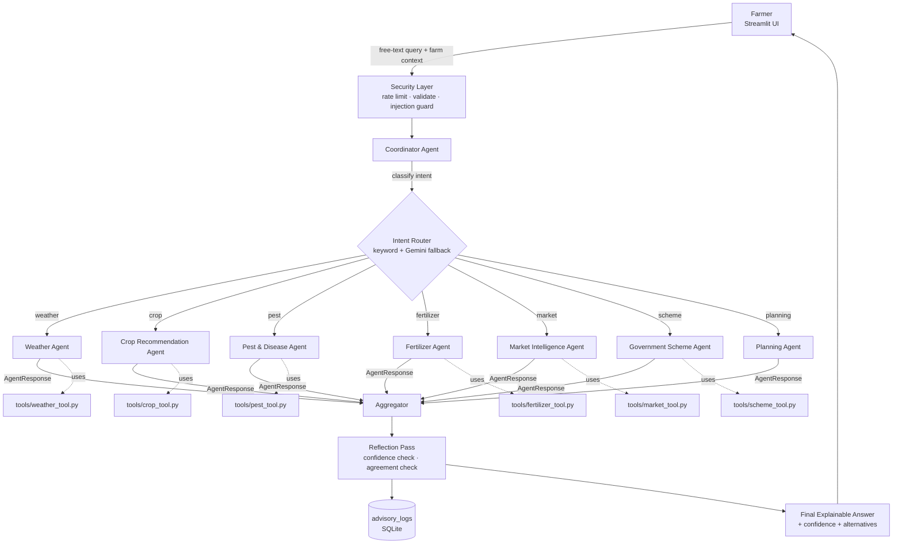
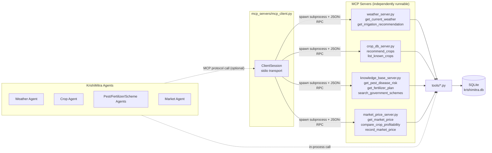
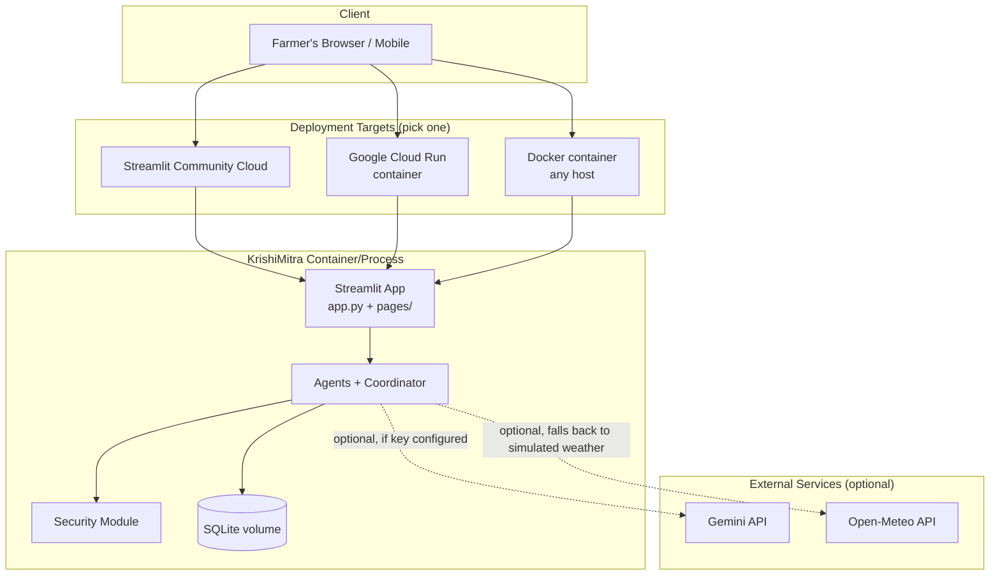

# KrishiMitra AI — Architecture

## 1. Agent Interaction Flow

The Coordinator Agent is the single entry point for every farmer query. It validates and secures input, classifies intent, dispatches to one or more specialist agents, reflects on their combined output, and aggregates a final explainable answer.

## 2. MCP Architecture

Each domain's tool logic is exposed twice: in-process (fast path used by default) and over MCP stdio servers (protocol-compliant path used for interoperability with other MCP hosts, and exercised directly in `tests/test_mcp.py`).

## 3. Deployment Architecture

## 4. Data Model

See `database/schema.sql` for the full SQLite DDL. Summary:

| Table | Purpose |
|---|---|
| `users` | Farmer accounts (phone stored as a hash, never plaintext) |
| `farm_profiles` | One or more plots per farmer: region, soil, area, irrigation source |
| `crop_history` | What was grown, when, and yield outcome |
| `weather_logs` | Cached/observed weather readings per region |
| `advisory_logs` | Every recommendation + reasoning, for audit & explainability |
| `market_data` | Crop price snapshots per market/region |
| `government_schemes` | Curated scheme reference data |

## 5. Explainability Contract

Every agent returns an `AgentResponse` (see `agents/base_agent.py`) with four mandatory fields: `recommendation`, `confidence_score` (0–100), `factors_considered`, and `alternatives`. This is enforced by the dataclass itself, not left to convention — the Coordinator's aggregation step can rely on every specialist response having this shape.
